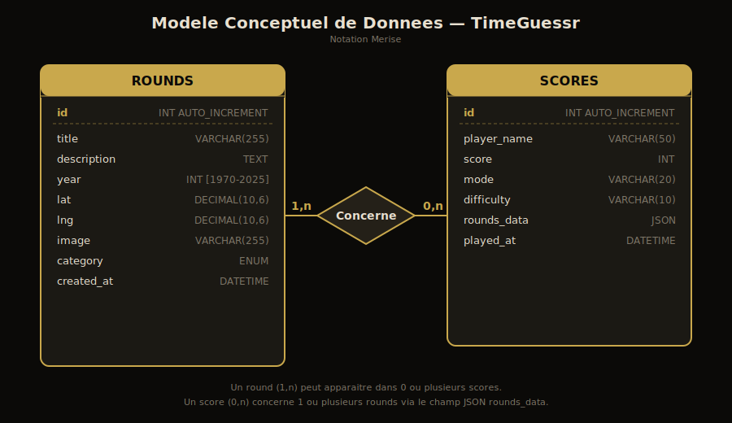

# TimeGuessr

Jeu web de geolocalisation et datation de photos historiques. Devinez le lieu et l'epoque de chaque photo pour marquer des points. 5 rounds par partie, score maximum de 10 000 points.

## Prerequis

- PHP 8.0+
- MySQL 8.0+
- Navigateur moderne (ES6+)

## Installation et lancement

### Option A — script automatique (recommande)

```bash
chmod +x setup.sh && ./setup.sh
```

### Option B — etape par etape

```bash
# 1. Creer la base de donnees et l'utilisateur
sudo mysql < data/schema.sql
sudo mysql timeguessr < data/seed.sql

# 2. Lancer le serveur PHP
php -S localhost:8080
```

### 3. Acceder au jeu

- Jeu : [http://localhost:8080](http://localhost:8080)
- Admin : [http://localhost:8080/admin.php](http://localhost:8080/admin.php) (mot de passe : `timeguessr2025`)

## Stack technique

| Composant    | Technologie                   |
|-------------|-------------------------------|
| Backend     | PHP 8 + PDO MySQL             |
| BDD         | MySQL 8 (InnoDB, utf8mb4)     |
| Frontend    | HTML5, CSS3, JavaScript ES6   |
| Carte       | Leaflet.js (CDN) + CartoDB    |
| Sons        | Web Audio API                 |

## Structure du projet

```
time_guessr/
  index.php          Page principale du jeu
  admin.php          Interface d'administration (CRUD rounds)
  submit_score.php   API POST de soumission de score
  db.php             Connexion PDO centralisee
  app.js             Moteur de jeu complet (JS)
  style.css          Styles du jeu
  data/
    schema.sql       Creation de la BDD et des tables
    seed.sql         Insertion des 15 rounds initiaux
    rounds.json      Ancien stockage JSON (conserve pour reference)
  images/            Photos des rounds
```

## Etat d'avancement par jalon

| Jalon | Description                              | Statut |
|-------|------------------------------------------|--------|
| A     | Interface de jeu fonctionnelle           | Fait   |
| B     | Panel admin (CRUD rounds)                | Fait   |
| C     | Base de donnees MySQL/PDO                | Fait   |
| C+    | API de soumission de score               | Fait   |
| D     | Modes de jeu (classique, chrono, daily, duel) | Fait |
| E     | Systeme de scoring avance (streak, hints)| Fait   |

## Modele Conceptuel de Donnees (MCD)



## Dictionnaire de donnees

### Table `rounds`

| Colonne     | Type                                    | Description                          |
|-------------|-----------------------------------------|--------------------------------------|
| id          | INT AUTO_INCREMENT PK                   | Identifiant unique du round          |
| title       | VARCHAR(255) NOT NULL                   | Titre/nom du lieu                    |
| description | TEXT NOT NULL                            | Description de la photo              |
| year        | INT NOT NULL CHECK(1970-2025)           | Annee de la photo                    |
| lat         | DECIMAL(10,6) NOT NULL                  | Latitude du lieu                     |
| lng         | DECIMAL(10,6) NOT NULL                  | Longitude du lieu                    |
| image       | VARCHAR(255) NOT NULL                   | Chemin vers l'image (ex: images/01.jpg) |
| category    | ENUM('monuments','villes','evenements') | Categorie du round                   |
| created_at  | DATETIME DEFAULT CURRENT_TIMESTAMP      | Date de creation                     |

### Table `scores`

| Colonne     | Type                              | Description                              |
|-------------|-----------------------------------|------------------------------------------|
| id          | INT AUTO_INCREMENT PK             | Identifiant unique du score              |
| player_name | VARCHAR(50) DEFAULT 'Anonyme'     | Nom du joueur                            |
| score       | INT NOT NULL                      | Score total de la partie                 |
| mode        | VARCHAR(20) DEFAULT 'classic'     | Mode de jeu (classic, chrono, daily, duel) |
| difficulty  | VARCHAR(10) DEFAULT 'normal'      | Difficulte (easy, normal, expert)        |
| rounds_data | JSON NULL                         | Detail des reponses par round            |
| played_at   | DATETIME DEFAULT CURRENT_TIMESTAMP| Date de la partie                        |

## Specifications du jeu

### Scoring

- **Lieu** : 1 000 pts max, decroissance exponentielle selon la distance (parametre par difficulte)
- **Date** : 1 000 pts max, decroissance exponentielle selon l'ecart en annees
- **Bonus temps** : 30% du score * (temps restant / temps total) en mode chrono/expert
- **Streak** : bonus multiplicateur (x1.1 a x1.5) pour les bonnes reponses consecutives (> 1 200 pts)
- **Indices** : -200 pts par indice utilise (mode normal)

### Modes de jeu

- **Classique** : 5 rounds, pas de limite de temps
- **Chrono** : temps limite par round (selon difficulte)
- **Defi Quotidien** : memes photos pour tous les joueurs chaque jour (seed deterministe)
- **Duel** : 2 joueurs sur le meme appareil, memes photos

### Administration

- Authentification par mot de passe (bcrypt)
- CRUD complet sur les rounds (ajout, modification, suppression)
- Upload d'images (JPG, PNG, WebP, max 5 Mo)
- Positionnement sur carte interactive (Leaflet)
- Protection CSRF sur toutes les actions

### API de score

- `POST /submit_score.php` : sauvegarde le score d'une partie
- Validation serveur : annee (1970-2025), coordonnees numeriques, round_id existant
- Corps JSON attendu : `{ player_name, score, mode, difficulty, rounds_data }`

## Configuration base de donnees

La connexion est configuree dans `db.php` :
- Host : `127.0.0.1`
- BDD : `timeguessr`
- User : `timeguessr`
- Password : `timeguessr`
